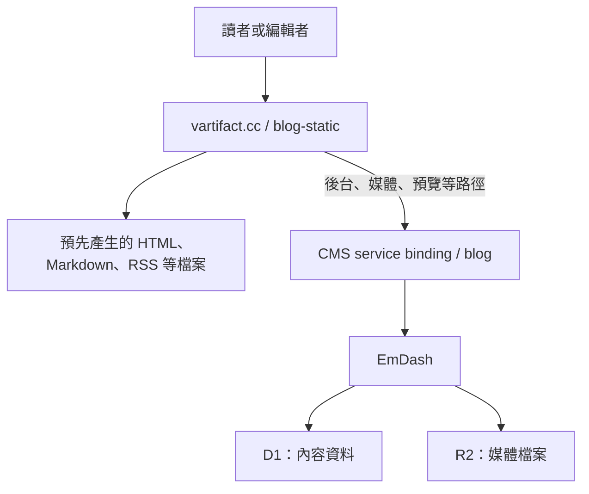

# 從一次 503 開始：把 Astro 與 EmDash 拆成後台和靜態網站

我的部落格 Vartifact 使用 Astro 與 EmDash，部署在 Cloudflare Workers。原本由同一個 Worker 處理內容管理、文章查詢，以及公開頁面的伺服器端渲染。

這次調整的起點很直接：打開〈Astro 與 EmDash〉，頁面出現 503。

查完記錄、確認帳號使用 Workers Free 後，我決定保留 EmDash 的編輯後台，把公開文章改成發布後重新建置的靜態網站。最後拆成兩個 Worker，後台網址維持不變，也接上了自動建置與部署。

這篇記錄 2026 年 9 月 19 日的實作過程。當時使用 Astro 7.2.7、EmDash 0.35.0；方案限制與工具行為可能隨版本改變。

## 503 的背後，是請求碰到了 CPU 限制

503 只是外部看到的結果，單靠狀態碼無法判斷原因。這次的關鍵證據來自 Worker 即時記錄：文章請求執行時碰到了 CPU 時間限制。

Workers Free 的 HTTP 請求 CPU 時間限制是 10 ms。這裡計算的是 CPU 執行程式的時間；等待網路、D1 查詢或其他 I/O 的時間，不等於 CPU 時間。因此，請求總共花了多久，不能直接拿來判斷是否超限。[Cloudflare 的限制說明](https://developers.cloudflare.com/workers/platform/limits/)

原本的文章路徑需要在請求期間取得內容，再完成頁面渲染。文章裡還有程式碼區塊等內容，這些工作都增加了渲染負擔。記錄能支持「這條請求路徑碰到 CPU 上限」；沒有逐段 profiling 的情況下，不能把全部成本歸因於某一個套件。

快取有幫助，但沒有消除第一次產生頁面的需求。快取未命中或需要更新時，仍然得完成渲染。如果這一步就超限，後面也沒有成功的頁面可以快取。

可以考慮調整方案，也可以繼續降低 SSR 的成本。這次我選擇改變渲染時機：文章很少修改，卻會被反覆閱讀，適合在發布後先產生 HTML。

## 為什麼拆成兩個 Worker？

靜態資源與動態 API 可以放在同一個 Worker。Cloudflare 的 Static Assets 支援預設先找靜態檔案，也能指定哪些路徑先執行 Worker。因此，靜態網站本身不要求一定拆成兩個 Worker。[Static Assets 路由說明](https://developers.cloudflare.com/workers/static-assets/routing/worker-script/)

這個專案選擇拆開，是為了讓部署內容與責任更清楚：

| Worker        | 負責的工作                                               |
| ------------- | -------------------------------------------------------- |
| `blog`        | EmDash 後台、D1、R2、媒體、草稿預覽、排程與 Queue        |
| `blog-static` | 公開靜態頁面、Markdown 格式選擇，以及必要的 CMS 請求轉送 |

`vartifact.cc` 綁定到 `blog-static`。公開網站需要存取後台時，透過名為 `CMS` 的 service binding 呼叫 `blog`。



後台仍然使用原本的網址：

```text
https://vartifact.cc/_emdash/admin
```

這樣就能保留原本的網域、cookie 與登入流程。CMS Worker 不再宣告公開網域；兩個 Worker 也都關閉 `workers.dev` 與版本預覽網址。

還有一個實際好處：內容更新後，只需要重新部署公開網站。後台程式與資料庫不必跟著每次文章發布一起更新。

## 同一套版型，在建置時取得已發布內容

我沒有另外維護一份文章版型，而是讓 CMS 建置與靜態建置共用既有的 Astro 頁面和 EmDash renderer。

兩種建置的主要差別在資料來源與輸出位置：

| 項目             | CMS 建置                         | 靜態建置                       |
| ---------------- | -------------------------------- | ------------------------------ |
| 文章來源         | 既有 EmDash 查詢                 | 建置開始時取得的已發布內容快照 |
| 輸出目錄         | `dist/cms`                       | `dist/static-build`            |
| 公開頁面渲染時機 | 保留伺服器能力，供預覽等需求使用 | 建置期間預先渲染               |
| 部署內容         | CMS Worker 與其資源              | `client` 目錄與小型路由 Worker |

CMS 新增一個 `/_site/snapshot.json` 端點，回傳已發布文章。建置程式必須帶上 `STATIC_BUILD_TOKEN` 才能讀取；沒有憑證的請求會得到 401，回應也設定為不可快取。

建置流程先取得這份快照，確認格式與發布狀態，再讓 Astro 讀取它。動態文章與標籤路徑則透過 `getStaticPaths()` 列出要產生的頁面。

這裡有個容易混淆的細節：專案仍保留 `output: "server"` 與 Cloudflare adapter，靜態建置也可能產生伺服器端輸出。但公開 Worker 實際部署的只有 `dist/static-build/client` 和小型路由程式。讀者開啟文章時，不會執行 Astro SSR。

取得內容失敗時，建置會停止。流程不會改用本機 seed 或上次的快照，避免把錯誤來源的內容當成最新版本發布出去。

## 發布之後，讓 Queue 觸發重新建置

把文章變成靜態檔案之後，下一個問題就是：EmDash 的內容變更，要怎麼傳到公開網站？

這次新增了 `static-publishing` 外掛，處理文章發布、下架、刪除與還原事件。成功的標籤及媒體修改，也會排入建置工作。草稿自動儲存則不直接觸發公開網站重建。

完整流程如下：

```text
EmDash 內容變更
  → blog-static-builds Queue
  → CMS Worker 消費訊息
  → Cloudflare Deploy Hook
  → Workers Builds 取得 GitHub main 的程式碼
  → 讀取最新已發布內容快照
  → Astro 產生並檢查靜態檔案
  → 部署 blog-static
```

Deploy Hook 可以透過 HTTP 請求啟動指定分支的建置，適合用來接 CMS 的內容事件。Hook 網址本身就具有觸發能力，必須當成憑證保存，不應放進 Git 或公開文章。[Deploy Hooks 文件](https://developers.cloudflare.com/workers/ci-cd/builds/deploy-hooks/)

Queue 的設定是每批最多 100 筆，最多等待 30 秒。同一批的內容事件只呼叫一次 Hook，減少連續操作產生的重複建置。這是批次合併，並不保證所有相近事件永遠只產生一次建置。

消費端會檢查 Hook 的 HTTP 回應，以及回傳內容中的成功狀態與 build ID。只有確認建置請求被接受，才確認這批訊息已處理；呼叫失敗則交給 Queue 重試。

這也劃出一個清楚的界線：Queue 能重試「觸發建置失敗」，不代表之後的 Astro 編譯或部署失敗也會自動重試。Hook 接受請求後，後續結果仍要看 Workers Builds 的記錄。

Workers Builds 使用的指令是：

```text
Build command:  npm run build:static
Deploy command: npm run deploy:static
```

程式碼來自 GitHub 的 `main`，文章則來自 EmDash。這讓內容發布不需要產生新的 Git commit，但建置流程本身有改動時，必須先把程式碼推送到遠端。

## 靜態化後，還有哪些請求需要執行程式？

公開頁面預先產生之後，仍有幾個功能需要保留。

首先是 Markdown。網站支援對同一個文章網址送出 `Accept: text/markdown`，取得 Markdown 內容。`blog-static` 會先判斷格式，再選擇對應的靜態檔案，並保留 `Vary: Accept`。文章本身不會因為格式選擇而重新渲染。

其次是後台、媒體和預覽。`/_emdash/*`、`/covers/*`、`/_image`，以及帶有 `_preview` 的文章請求，都需要轉送到 CMS。後台與預覽使用的部分雜湊 JS、CSS 檔案，也要能從 CMS 取得。

所以這次完成的是「公開頁面靜態化」。圖片處理、後台與草稿預覽仍然有動態部分，不能把整個網站描述成完全不執行 Worker。

一般不存在的公開頁面則維持靜態 404，不會轉回 CMS 嘗試 SSR，避免讓未知路徑重新走進原本較重的渲染流程。

另一個需要補上的地方是回應標頭。公開頁面不再經過原本的 Astro middleware，原先由 middleware 加上的安全性標頭，也要改由靜態資源的 `_headers` 等對應機制提供。

## 部署時，比拆分程式碼更容易漏掉的事

這次實作有幾個細節，值得留給之後的自己。

**兩個 Worker 必須明確使用各自的部署設定。** CMS 使用自己的建置輸出設定；靜態網站使用 `wrangler.static.jsonc`。如果 Workers Builds 的部署指令仍讀取根目錄的 CMS 設定，就可能部署錯誤的目標。

```sh
# CMS 建置與部署
npm run build:cms
npx wrangler deploy --config dist/cms/server/wrangler.json

# 公開網站建置與部署；執行前需注入 STATIC_BUILD_TOKEN
npm run build:static
npm run deploy:static
```

**移轉網域之後，也要更新 CMS 的來源設定。** 只在控制台把網域交給 `blog-static` 還不夠。如果 CMS 的設定檔仍宣告同一個網域，下次部署就可能再次改變路由。

**本機部署成功，不代表遠端建置一定成功。** 遠端需要正確的 Node.js 版本、建置 secret、部署權杖，以及已推送的新程式碼。這次指定 Node.js 24，並在 Workers Builds 另外設定 `STATIC_BUILD_TOKEN`。

**Wrangler 的登入權限與 Workers Builds 的設定權限需要分別確認。** 這次 Wrangler 可以部署 Worker，但同一組登入授權無法透過 API 完成 Workers Builds 設定。最後改由已登入的 Cloudflare 控制台連接既有 GitHub 整合，再用實際建置驗證結果。

**不要把 D1、R2 搬家當成這次拆分的必要步驟。** CMS 繼續使用原本的資料庫與媒體儲存。這次沒有為了靜態化而遷移正式內容或更動資料表結構，部署前也保留了 D1 Time Travel bookmark 與 Worker 版本紀錄。

## 實測結果，以及這些數字代表什麼

本機檢查與 60 項測試通過後，我部署兩個 Worker，再送出一筆正式 Queue 測試訊息，驗證從 Queue、Deploy Hook、Workers Builds 到公開部署的流程。

那次建置讀取了 1 篇已發布文章，成功產生靜態檔案並部署。從建置工作建立到完成約 72 秒；這個數字不包含之前可能發生的 Queue 等待，也不能當成大量文章時的固定耗時。

| 驗證項目                           | 當次結果                         |
| ---------------------------------- | -------------------------------- |
| 原本發生 503 的文章                | HTTP 200                         |
| 同一文章網址的 HTML／Markdown 切換 | 兩者皆為 200，格式正確           |
| 首頁、標籤頁、RSS、sitemap         | HTTP 200                         |
| 不存在的公開路徑                   | HTTP 404                         |
| 未帶憑證的內容快照請求             | HTTP 401                         |
| EmDash 後台                        | 原網址可載入已登入的管理介面     |
| 發布重建外掛                       | 在後台確認為啟用狀態             |
| 正式建置 Queue                     | 測試訊息已消費，待處理數為 0     |
| 瀏覽器中的文章與封面               | 正常載入，該次檢查沒有主控台錯誤 |

靜態 Worker 的程式上傳大小約 2.15 KiB，gzip 後約 0.94 KiB，部署記錄中的啟動時間為 1 ms。這些數字描述的是小型路由程式，不包含全部靜態資源，也不等於完整網頁的載入時間。

驗證範圍也需要說清楚：這次正式環境的流程測試，是直接送入 Queue 的驗收訊息。沒有為了測試而修改、重新發布或下架既有文章。發布事件的程式接線、外掛啟用狀態，以及 Queue 之後的實際部署結果都有確認；「在編輯器按下發布，一路觀察到新文章上線」仍是另一項獨立的使用情境驗證。

## 我接受的取捨

最明顯的改變是，按下發布後，公開網站不會立刻更新。文章新增、修改或下架，都要等下一次建置與部署完成。

建置失敗時，上一個部署版本會繼續服務。這有助於維持閱讀體驗，但也表示下架需求不能只看 CMS 裡的狀態；需要確認公開部署已完成。

此外，拆成兩個 Worker 並沒有提高 Workers Free 的 CPU 配額。後台操作、預覽、圖片處理，以及內容快照端點，仍然要留意各自的成本。未來文章增加、快照變大，可能需要分頁匯出、增量建置，或重新評估方案。

Queue 的批次設定也不是完整的建置排程器。若未來發布頻率提高，還需要觀察重複觸發、建置排隊，以及版本更新順序，不能只靠目前的批次合併就假設所有情況都已處理。

對目前這個以文章閱讀為主、更新頻率不高的部落格，我願意接受這段發布等待時間。編輯流程仍留在 EmDash，讀者拿到的則是已經準備好的頁面。這次 503 讓我重新檢查了一件很實際的事：哪些工作值得在每次請求時執行，哪些工作可以在內容改變時先完成。

實作保存在 [Vartifact 的拆分提交](https://github.com/Mingx94/site/commit/2db0d7bf5d94c4f162d9660b3e7f478055f3bae6)。
